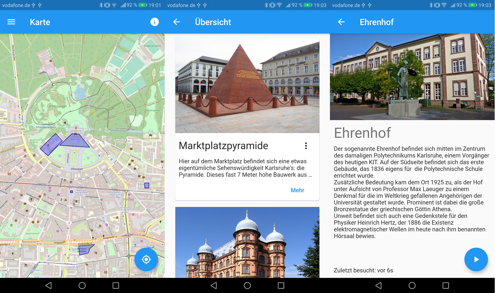

Dieses Projekt ist eine Art GPS-gestützter Audioguide durch Karlsruhe. Es ist im Rahmen der Vorlesung „Mobile Computing and Internet of Things“ des [TECO](https://www.teco.edu/) entstanden.

Wenn du an einer der in der Karte blau eingezeichneten Regionen vorbeikommst, lädt die App eine Audioinformation zu dem jeweiligen Ort. In der Navigationsleiste kannst du dann auf Play drücken.

Die Standortberechtigung wird benötigt, um zu erkennen wo das Smartphone sich gerade befindet. Diese App erfordert keine Internetverbindung! Die Karte sowie die Audiodateien funktionieren vollständig offline.

## Screenshots




## Orte
Zurzeit sind folgende Orte in der App:

* Schloss
* Bundesverfassungsgericht
* Badisches Staatstheater
* Ehrenhof am KIT
* Hebeldenkmal
* Gerwigbrunnen in der Oststadt
* Schloss Gottesau
* Marktplatzpyramide

## Mithelfen
Wenn du einen Lieblingsort mit kultureller Signifikanz in Karlsruhe hast, kannst du ihn gerne zur App hinzufügen. Folgende Schritte sind dazu notwendig:

Einen kurzen Text zum Ort schreiben, ein Bild davon aufnehmen, den Text einsprechen.

Dann im Ordner assets/locations/\<deinelocation\> eine neue Datei namens `info.yml` anlegen:

```yaml
name: Name des Ortes
audio: audiodatei.mp3
cover:
  src: bildpfad.jpg
  attribution: Urheber des Bildes hier angeben
zone: 
  - {lat: 49.000, lng: 8.404}
  - {lat: 49.000, lng: 8.404}
  - {lat: 49.000, lng: 8.404}
description: >
  Hier Beschreibung wie in Audiodatei aufführen.


```

Hier ist zone ein Liste von Koordinaten die ein Polygon aufspannen, dass den Ort umgrenzt. Dies ist notwendig, um die Audiodatei korrekt wiederzugeben wenn sich der Nutzer in dem Bereich befindet.


Zusätzlich muss in `pubspec.yaml` unter flutter/assets der `assets/locations/deinelocation/` Ordner aufgeführt werden und die Liste in `assets/locations/list.yml` ergänzt werden. Siehe z.B. auch [diesen Commit](https://github.com/stelzch/kastadttour/commit/2f69e3d9f24d098304e24aac387c004cea9c61a9) als Referenz.
